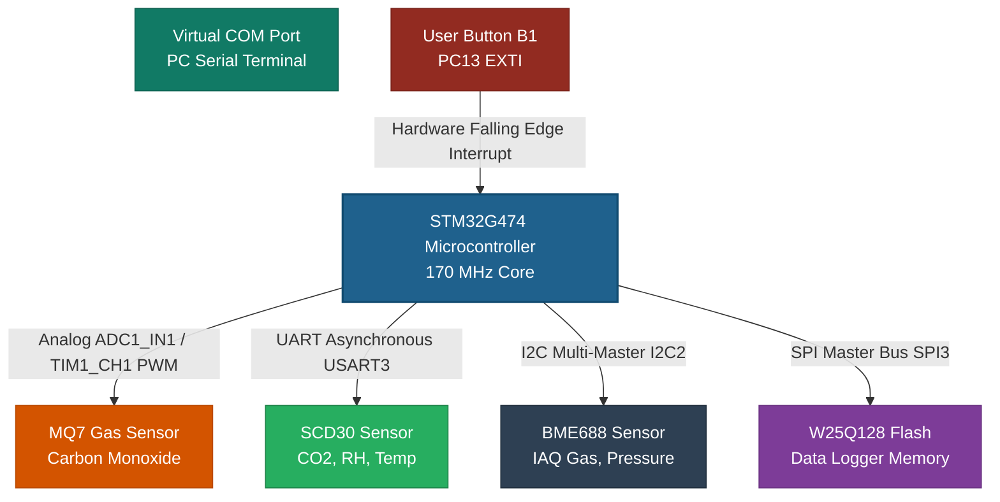

## System Architecture & Interconnect Topology

MetallicBear is a personal learning lab for bare-metal STM32 device driver development, not a product. The goal is to practice writing peripheral drivers from scratch — directly against ST's Low-Layer (LL) register API, with no HAL abstractions and no RTOS — across a progression of bus types (SPI, I2C, UART+DMA, ADC/timers) of increasing complexity.

The project is written in C and targets the NUCLEO-G474RE board (STM32G474RET6). An air-quality sensor array (CO, CO2/RH/temp, IAQ gas) logged to external flash and streamed over a serial console was chosen as a realistic, multi-peripheral vehicle to drive that learning — it gives each driver a concrete communication link, a register/protocol contract, and real timing constraints to get right, rather than being the point of the project itself.

---

## Hardware Module Interface Mapping

| Module | Core Purpose | Interface Type | Pin Allocation | Electrical Requirements |
| :--- | :--- | :--- | :--- | :--- |
| **MQ7** | Toxic Carbon Monoxide tracking | Analog (ADC) + PWM | PA0 (ADC1_IN1), PA8 (TIM1_CH1) | 5.0V / 1.4V Dual VCC Cycles |
| **SCD30** | Optical NDIR CO2 monitoring | Asynchronous UART | PB10 (TX), PB11 (RX) [USART3] | 3.3V - 5.5V DC VCC |
| **BME688** | 4-in-1 Volatile Gas/IAQ | I2C Multi-Master Bus | PC4 (SCL), PA8 (SDA) [I2C2] | 1.2V - 3.6V DC VCC (3.3V Typ) |
| **BME688 delay** | Microsecond delay source for the Bosch BME68x API's `bme688_delay_us()` callback | Timer (no I/O pin) | TIM6, internal only | N/A |
| **W25Q128**| 128M-bit Non-Volatile Flash | SPI Master Bus | PC10(CLK), PC11(MISO), PC12(MOSI), PB0(CS) [SPI3] | 2.7V - 3.6V DC VCC |
| **Button B1** | Hardware Event Interrupt | External EXTI Line | PC13 (Hardwired Blue Switch) | Active-Low External Pull-up |

## Low-Level Driver Learning Roadmap

To master bare-metal peripheral programming from scratch, EnviLogger drivers are partitioned and developed using a clear sequential protocol roadmap:

### Phase 1: W25Q128 Serial Flash (SPI Master)
* **Learning Intent:** Master master-slave hardware clocks, manual Chip Select pin control, data shifting alignment, instruction sets, and non-volatile flash page boundary processing.
* **Why first:** The clean, deterministic nature of synchronous SPI communication simplifies checking byte integrity during writes and reads.

### Phase 2: BME688 Air Quality Sensor (I2C Register-Mapped Bus)
* **Learning Intent:** Master I2C Start/Stop conditions, 7-bit slave address matching, register pointer selection writes, multi-byte burst reading, and executing factory calibration polynomials.
* **Why second:** Introduces standard register addressing architectures over a shared 2-wire bus layout.
* **Delay source:** The Bosch BME68x sensor API requires a microsecond-resolution delay callback (`bme688_delay_us()` in `Drivers/BSP/uv/BME688/bme688_i2c.c`), which `HAL_Delay()` cannot provide since it's driven by the 1 kHz SysTick tick. TIM6 (a basic timer with no external pins, freeing it from pin-mux conflicts) is used as a free-running microsecond counter for this purpose instead.

### Phase 3: SCD30 Gas Array Module (UART Frame Parsing)
* **Learning Intent:** Master asynchronous streaming, Direct Memory Access (DMA) channel processing utilizing a circular ring buffer design, and verification of multi-byte Modbus RTU checksum frames (CRC16).
* **Why third:** Shifts focus from low-level register matching to heavy frame structure processing and error validation protocols.

### Phase 4: MQ7 Sensor Management (MCU Core Analog & Timers)
* **Learning Intent:** Master internal microcontroller core configurations. Drive external transistor paths using hardware PWM outputs, execute tracking time profiles, and isolate analog read windows.
* **Why last:** Teaches how to coordinate multiple internal chip systems (TIM and ADC blocks) to execute complex, time-dependent physical workloads.
